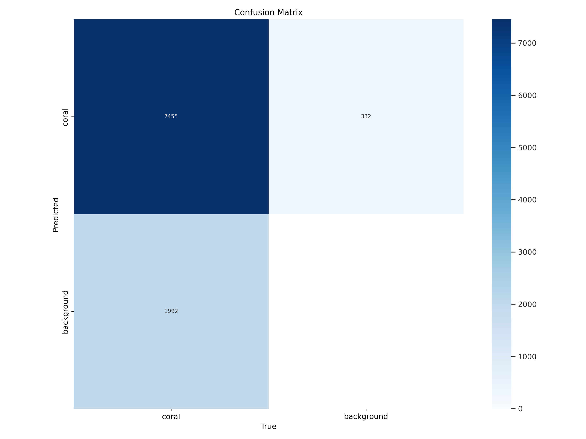

# Detecting Coral Eating Crown Of Thorns Starfish with YOLOv8

## Overview
The Great Barrier Reef faces significant ecological threats due to the overpopulation of crown-of-thorns starfish (COTS). This project aimed to develop a scalable and efficient object detection system using YOLOv8 to identify COTS in underwater imagery. By utilizing deep learning techniques, this system can assist in preserving coral ecosystems by enabling real-time monitoring of COTS outbreaks.


## Features
- **Model Architecture:** YOLOv8 for real-time object detection.
- **Dataset:** Underwater imagery collected via the Manta Tow method and annotated for COTS detection.
- **Augmentation:** Advanced techniques including mosaic, mixup, and perspective distortion.
- **Evaluation Metrics:** Precision, Recall, mAP50, mAP50-95.
- **Optimizations:** Hyperparameter tuning, SGD optimizer, and learning rate adjustments.


---

## Table of Contents
- [Introduction](#introduction)
- [Dataset](#dataset)
- [Methodology](#methodology)
- [Results](#results)
- [Installation](#installation)
- [Usage](#usage)
- [Future Work](#future-work)
- [Acknowledgments](#acknowledgments)

---

## Introduction
The project addresses the ecological challenge posed by COTS using deep learning-based object detection. Traditional methods like the Manta Tow survey are constrained by scalability and reliability. This research leverages YOLOv8 to automate COTS detection, improving conservation efforts for marine biodiversity.

## Dataset
The dataset was collected using GoPro cameras attached to Manta Tow boards, capturing high-resolution underwater video. The videos were annotated to mark COTS instances, resulting in a comprehensive dataset tailored for object detection research.


### Key Dataset Features:
- **Resolution:** 3840x2160 pixels.
- **Annotations:** Bounding boxes for COTS.
- **Challenges:** Poor lighting, occlusion, and varying object scales.

## Methodology
The methodology incorporates:
- **Preprocessing:** Data cleaning, augmentation, and splitting.
- **Model Training:** Fine-tuning YOLOv8 using annotated datasets.
- **Evaluation:** Metrics like precision, recall, and mAP.

### Data Augmentation:


---

## Results
The YOLOv8 model was evaluated using different configurations. The small variant (YOLOv8s) outperformed the medium and large variants in precision, recall, and inference speed.

### Key Metrics:
| Model | Precision | Recall | mAP50 | mAP50-95 | Inference Time |
|-------|-----------|--------|-------|----------|----------------|
| YOLOv8s | 0.917 | 0.825 | 0.895 | 0.489 | 2.7 ms |
| YOLOv8m | 0.912 | 0.805 | 0.873 | 0.465 | 5.6 ms |
| YOLOv8l | 0.883 | 0.724 | 0.798 | 0.380 | 9.0 ms |

### Performance Trends:


### Confusion Matrix:


---

## Installation
To get started with this project:

1. Clone the repository:
   ```bash
   https://github.com/vikasdimaniya/crown-of-thorns-starfish-Detection.git
   cd crown-of-thorns-starfish-Detection
   ```

2. Install dependencies:
   ```bash
   pip install -r requirements.txt
   ```

3. Download the dataset from kaggle and place it in the `data/` folder.

---

## Future Work
Future enhancements include:
- **Incorporating Transformer-Based Models:** For video analysis.
- **Advanced Augmentation Techniques:** To handle motion blur.
- **Larger Datasets:** Expanding the training data to improve robustness.

---

## Acknowledgments
This project utilized the YOLOv8 framework developed by Ultralytics and underwater datasets provided by CSIRO.

---

Happy Detecting!
